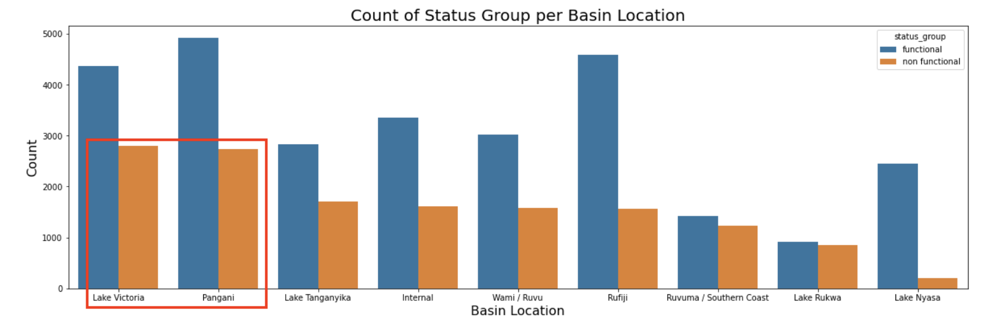
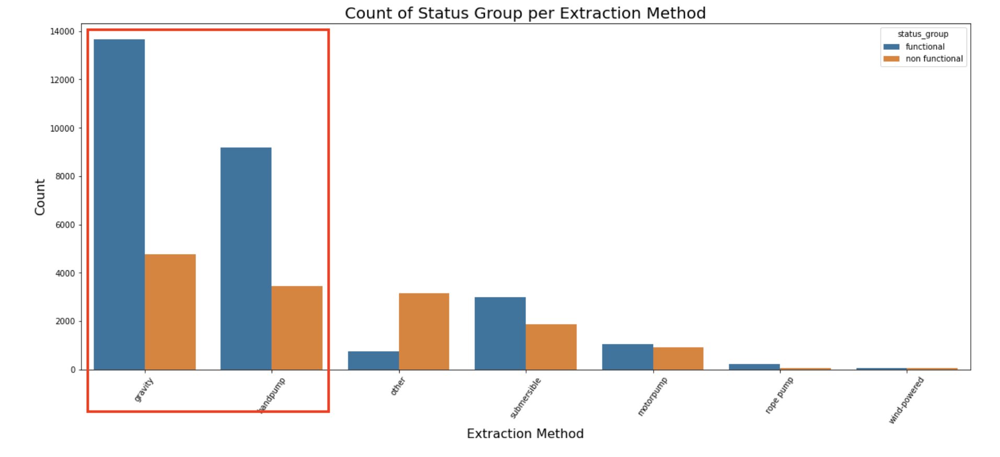

<h1 align="center">Tanzanian Water Wells Analysis</h1>

## Introduction
In this project our team build a classifier that predicted the condition of water wells in Tanzania. The classifier's we decided to go with were logistic regression and a decision tree classifier. We also tuned our decision tree with hyperparameters. Our stakeholders for this project is the Government of Tanzania as we are aiming to minimize the Type 1 error and false positives; in this case minimizing identifying wells as functioning when they are actually not functioning. We decided to focus on this because we believe that those in need of water resources would much rather be able to still receive those resources despite us identifying the well as non functioning. To state that a well is functioning and have people not be able to receive water would be extremely alarming. 

## Understanding the Data Sources
Within our 'data' folder you will find the main data sources in csv format:

* **Training_Set_Values**: This file contains all the bulk of our data and will be referenced and altered throughout the notebook as 'train_values_df'.
* **Training_Set_Labels**: This file will be merged with 'train_values_df'.
* **Test_Set_Values**: VOID/Dropped
* **Submission_Format**: VOID/Dropped

## Data Limitations
1. **Dropping Columns**:
- For example, **'scheme_name'** is missing 28,166 values out of 59,400 in train_values_df. As a result, we will drop this column and others we wont need.
2. **Dropping rows with missing values**:
- For rows with a few missing values, we will drop the rows so we can preserve the columns.
3. **Data Type Conversion**:
- The 'date_recorded' column was the only column that needed to be changes to datetime
4. **Renaming Columns**:
- Many of the columns have names that are confusing or dont represent the data. These have been changed.
5. **Target changes**:
- Target variable 'status_group' contained the values functional, non functional & functional; needs repair. We have decided to combine functional & functional; needs repair to create a binary target variable. 
- Based on this assumtpion, we are not aware of each circumstance of the repair required and would need more information to further assess.


## Data Analysis and Visualization
break down by basin location and how many wells are functional vs non functional


break down by the water extraction method and how many wells are functional vs non functional


break down by the source of the water and the quality for each source


## Conclusions
* Priority focus should be on Lake Victoria & Pangania as they have the most non functional wells at the moment
* When assessing current wells, replance existing extraction method with either gravity or handpump wells for better longevity
* If possible, equip the wells to a source such as spring, shallow well, river or machine dbh sources.


## Future Insights
We would like to dive deeper into the functional; needs repaired wells to determine if they are still accessable or if they require attention. We want to make sure any people in need of water is able to access it and this is one more step toward that goal.


## Repository Structure

```
├── images
├── data
    ├── submission_format.csv
    ├── test_set_values.csv
    ├── training_set_labels.csv
    ├── training_set_values.csv
├── README.md
└── well_analysis_notebook.ipynb
```